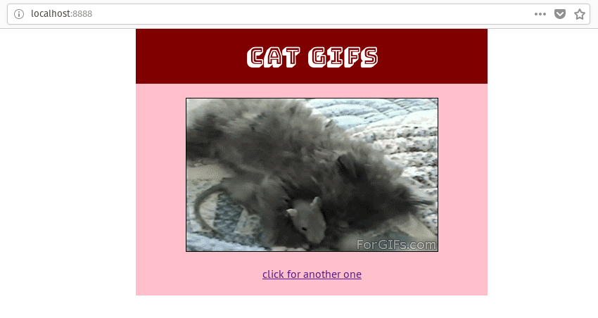

## catgifs

This is a Flask web app that displays random cat gifs. This app runs inside a
Docker container.

**Usage**:
Clone this repo: `git clone https://github.com/eightlimbed/catgifs.git`
Build the Docker image (must have Docker installed): `docker build -t catgifs .`
Start the app: `docker run -d --publish 8080:5000 catgifs`

You can now view the app at `http://localhost:8080`

